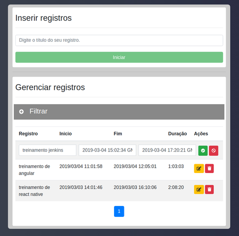

## Sumário

1. [Descrição](#1-Descrição)
2. [Instalação](#2-Instalação)

# 1. Descrição

### Sobre o projeto

Esse é o repositorio do projeto "Registro de Horas - Frontend".

A ideia é praticar programação com o Angular 7.

Não é intenção desse projeto aplicar as melhores práticas do Angular, até porque o objetivo do mesmo é o aprendizado.

Algumas `issues` serão criadas para aplicar refatorações e correções no projeto.

### A aplicação

O objetivo da aplicação frontend é adicionar, listar, editar e remover "registros de esforço de tempo". São envidas requisições para o backend e o mesmo persiste e retorna os dados do banco de dados, além de realizar o calculo da duração de cada registro.

### Tela

Segue abaixo a tela da aplicação:



# 2. Instalação

### Dependências

Instalar dependências:

```bash
$ npm install
```
### Servidor web do frontend

Executar o servidor web:
```bash
$ ng serve
```
### Backend

Instalar e executar ambiente do backend [aqui](https://github.com/arielalvesdutra/Registro-de-Horas-Backend).